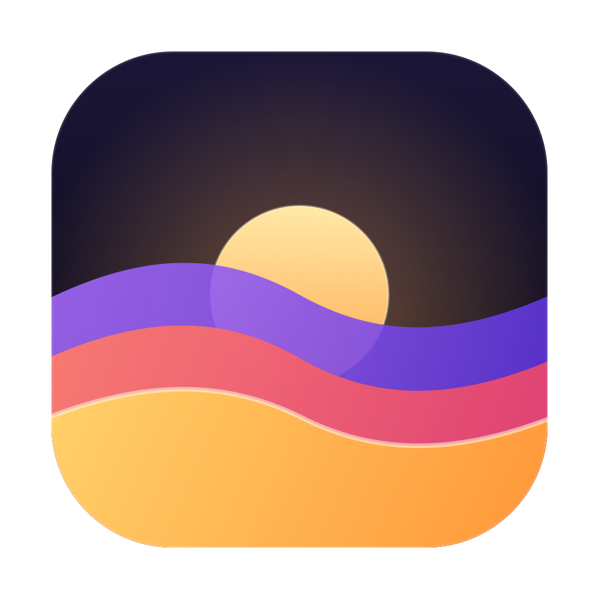

<p align="center">
  
</p>

<h1 align="center">OpenOSX</h1>

<p align="center"><em>An open-source operating system built on Darwin.</em></p>

OpenOSX is an open-source operating system built on Darwin, the OS foundation
underneath macOS, with one uncompromising rule: **everything we ship is built
from open source**. Kernel, drivers, bootloader, userland: no closed Apple
binaries anywhere in the boot chain.

The goal is an OS image that boots easily in common VMs (QEMU, VirtualBox,
VMware) from a fully open toolchain: the XNU kernel and kernel extensions in
this repo, loaded by an open EFI bootloader
([xnu-loader](https://github.com/PureDarwin/xnu-loader)), up to a real
userland, launchd, a shell, X11/Wayland, and a desktop environment.

## Heritage

OpenOSX is a successor to [PureDarwin](https://github.com/PureDarwin/PureDarwin)
([puredarwin.org](https://www.puredarwin.org)), the community project that kept
the dream of a usable standalone Darwin alive after OpenDarwin, and before that
to Apple's own open-source Darwin releases. Substantial portions of this tree
were authored by the PureDarwin developers and by Apple; see
[PUREDARWIN_LICENSE.txt](PUREDARWIN_LICENSE.txt), [APPLE_LICENSE.txt](APPLE_LICENSE.txt),
[APPLE_DRIVER_LICENSE.txt](APPLE_DRIVER_LICENSE.txt), and
[docs/PUREDARWIN_ATTRIBUTION.md](docs/PUREDARWIN_ATTRIBUTION.md). We are
grateful to both.

## Building OpenOSX

The supported build is **Nix**, on Linux or macOS (x86_64 or aarch64):

```sh
# One-time: the Apple SDK tarball is proprietary and cannot be fetched by Nix.
# Obtain MacOSX11.3.sdk.tar.xz and register it (Nix verifies its sha256):
nix-store --add-fixed sha256 /path/to/MacOSX11.3.sdk.tar.xz

# Build a bootable disk image (GPT: EFI system partition + root filesystem):
nix build .#image-minimal    # lean image: kernel, launchd, zsh, toybox
nix build .#image            # full image: X11/Wayland, XFCE, and friends
```

Run the result in QEMU:

```sh
nix run .#vm                 # boots result/openosx.img with serial on stdio
```

A classic CMake build of individual components on macOS also works; see
`CMakeLists.txt` and the CI workflows.

It should be noted that aarch64 support is an extreme work in progress and may break often.

## What's in the tree

- `src/Kernel/xnu`, the XNU kernel (Darwin 20.5 lineage, x86_64 + arm64)
- `src/Kernel/Extensions`, kernel extensions: ACPI, APIC, PCI, PS/2, HID,
  IDE/AHCI/NVMe, USB (UHCI/OHCI/EHCI/xHCI), e1000 + VirtIO net, framebuffers
  (GOP, VirtIO GPU, Intel Gen9), and filesystems (HFS+, ext4, APFS, msdosfs)
- `src/Libraries`, libSystem, CoreFoundation, dyld, launchd/XPC, objc4, and
  the rest of the userland library stack
- `src/Userspace`, userland programs (including fbDOOM, optionally)
- `nix/`, `flake.nix`, `image.nix`, the cross-compilation and image pipeline
- `tools`, host toolchain (cctools/ld64, mig, xar, kc-tools, xnu-loader)
- `docs/`, the engineering plans: [roadmap](docs/ROADMAP.md),
  [macOS app compatibility](docs/MACOS_COMPAT.md),
  [Aqua/UI stack](docs/AQUA_UI_PLAN.md),
  [multi-architecture](docs/MULTIARCH_PLAN.md), and the
  [GUI test corpus](docs/TEST_CORPUS.md)

## Use cases

OpenOSX is early. It boots, reaches a graphical session, has networking, a
shell and `sshd`, and builds reproducibly from source, but there is no package
manager, no installer, and no macOS application compatibility yet. What follows
is what it is *for*, split into what works today and where it is going.

### As a desktop OS

The long-term goal is a Darwin desktop that belongs to its users, with
macOS's foundations and none of its restrictions: no signing requirements, no
notarisation, no telemetry, no hardware lock-in, and every line of it buildable
from source on commodity PCs.

Today that means an X11 session with a window manager, a terminal, and the
userland in `docs/TEST_CORPUS.md`'s Tier 0. It is usable for exploring the
system, not for daily work.

Where it is going, in order: a desktop environment that is OpenOSX's own rather
than a borrowed one (see [docs/AQUA_UI_PLAN.md](docs/AQUA_UI_PLAN.md)), then the
ability to run real macOS applications through a clean-room AppKit and Quartz
implementation (see [docs/MACOS_COMPAT.md](docs/MACOS_COMPAT.md)). The second is
years of work and is described honestly as such in those documents.

### As a server OS

This is the nearer-term practical use, because the server-shaped parts of Darwin
are the parts that already work: `launchd` supervises services, `sshd` accepts
logins, networking comes up automatically, and `mDNSResponder`, `configd` and
`notifyd` all run.

The distinctive case is **building and testing Darwin software without Apple
hardware**. A CI runner that produces and exercises real Mach-O binaries against
a real XNU kernel, on ordinary x86_64 servers or in a VM, is something no Linux
box can offer and no Apple licence permits you to rent freely. Related uses that
follow from the same property:

- **Reproducible Darwin builds.** The whole OS is a Nix flake, so a build host is
  a pinned, hash-verified artifact rather than a hand-maintained machine.
- **Kernel and systems research.** A real XNU you can patch, instrument and boot
  in seconds under QEMU, which suits teaching Mach, IOKit and dyld, and
  security research that would otherwise require Apple hardware and fighting SIP.
- **Appliance and embedded-style workloads**, where launchd's supervision model
  and a small, auditable, fully-source-built image matter more than a large
  package ecosystem.

The honest caveat for both roles: OpenOSX has had no security review, no
hardening pass, and no stability guarantees. Run it in a VM, on a test machine,
or in a lab. Not on anything you care about, and not exposed to the internet.

## End Goal & Author Notes
OpenOSX is designed to be binary compatible with *macOS* whilst maintaining a pure FOSS design, the end goal of OpenOSX is
to be able to run most *macOS* apps directly on a FOSS operating system without proprietary hardware (and maybe be superior to linux, or never).


## License

Code inherited from Apple is under the
[Apple Public Source License](APPLE_LICENSE.txt) (drivers:
[APPLE_DRIVER_LICENSE.txt](APPLE_DRIVER_LICENSE.txt)). Code authored by the
PureDarwin project is under the [PureDarwin license](PUREDARWIN_LICENSE.txt).
New OpenOSX code is under the same terms unless noted otherwise.
